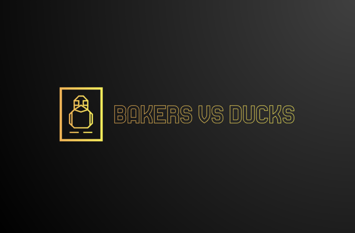
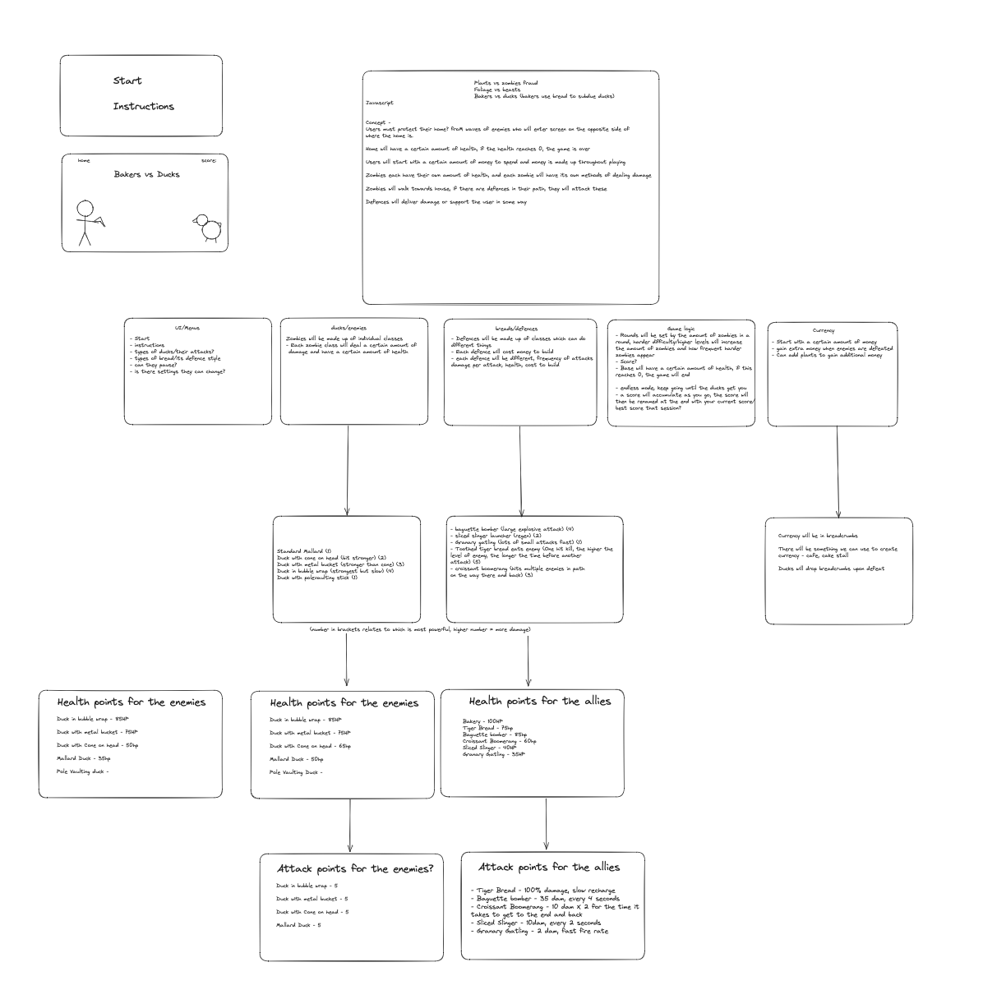
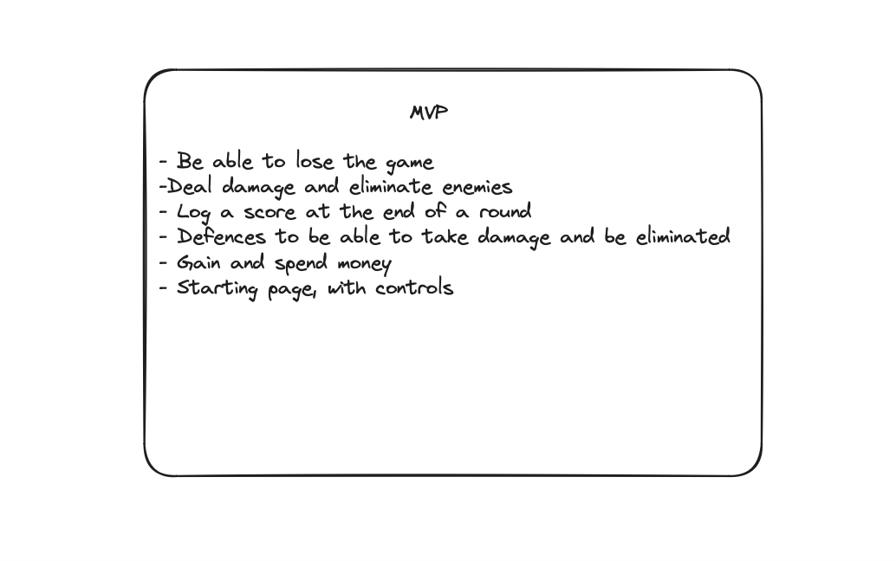
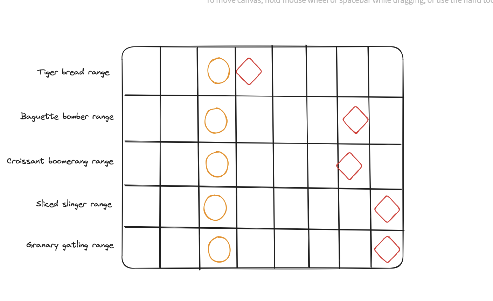
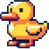
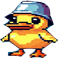
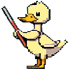
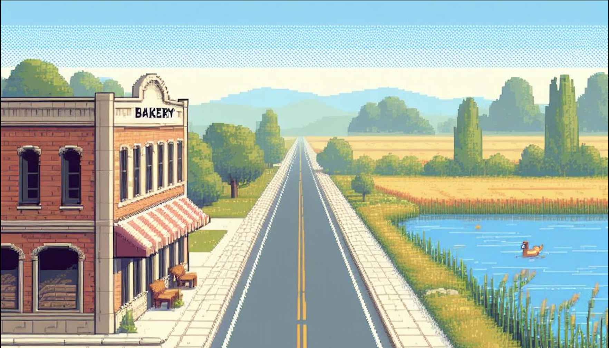
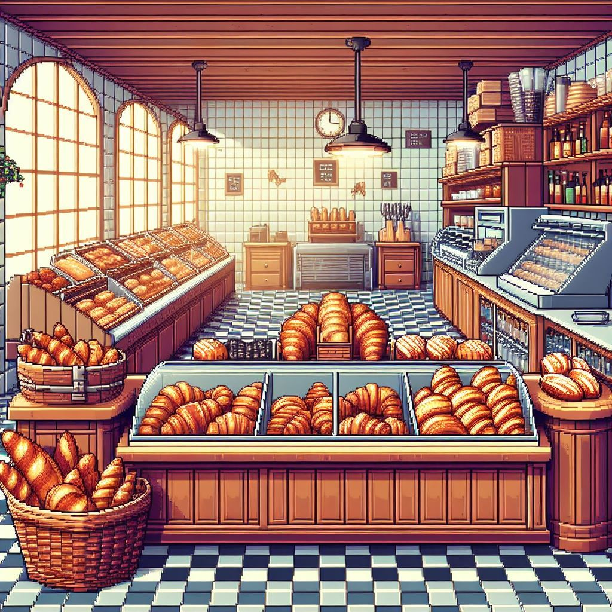

<!-- Improved compatibility of back to top link: See: https://github.com/othneildrew/Best-README-Template/pull/73 -->
<a name="readme-top"></a>
<!--
*** Thanks for checking out the Best-README-Template. If you have a suggestion
*** that would make this better, please fork the repo and create a pull request
*** or simply open an issue with the tag "enhancement".
*** Don't forget to give the project a star!
*** Thanks again! Now go create something AMAZING! :D
-->


<!-- PROJECT SHIELDS -->
<!--
*** I'm using markdown "reference style" links for readability.
*** Reference links are enclosed in brackets [ ] instead of parentheses ( ).
*** See the bottom of this document for the declaration of the reference variables
*** for contributors-url, forks-url, etc. This is an optional, concise syntax you may use.
*** https://www.markdownguide.org/basic-syntax/#reference-style-links
-->
[![Contributors][contributors-shield]][contributors-url]
[![Forks][forks-shield]][forks-url]
[![Issues][issues-shield]][issues-url]


<!-- PROJECT LOGO -->
<br />
<div align="center">
  <a href="https://github.com/pierro-yo/bakers-vs-ducks">
    
  </a>

  <h3 align="center">Bakers VS Ducks</h3>

  <p align="center">
    A whimsical strategy game where players defend their bakery using various baked goods against waves of mischievous ducks.
    <br />
    <a href="https://github.com/pierro-yo/bakers-vs-ducks"><strong>Explore the docs »</strong></a>
    <br />
    <br />
    <a href="#usage">View Demo</a>
    ·
    <a href="https://github.com/pierro-yo/bakers-vs-ducks/issues">Report Bug</a>
  </p>
</div>


<!-- TABLE OF CONTENTS -->
<details>
  <summary>Table of Contents</summary>
  <ol>
    <li>
      <a href="#about-the-project">About The Project</a>
          <ul>
            <li><a href="#potential-enhancements-with-extended-time">Potential Enhancements with Extended Time</a></li>
          </ul>
      <ul>
        <li><a href="#built-with">Built With</a></li>
      </ul>
    </li>
    <li>
      <a href="#getting-started">Getting Started</a>
      <ul>
        <li><a href="#prerequisites">Prerequisites</a></li>
        <li><a href="#installation">Installation</a></li>
      </ul>
    </li>
    <li><a href="#planning">Planning</a></li>
    <li><a href="#contributors">Contributors</a></li>
    <li><a href="#acknowledgments">Acknowledgments</a></li>
  </ol>
</details>


<!-- ABOUT THE PROJECT -->
## About The Project


This project was initiated as part of Makers' academic curriculum to facilitate collaborative learning and teamwork. Notably, it marked the first endeavor in game development for all contributors involved, serving as a pivotal opportunity to apply newfound skills and explore the intricacies of game design collectively.

While there are many captivating games available, none quite capture the whimsical charm of defending your bakery from mischievous ducks like "Bakers vs Ducks." Crafted with a unique blend of strategy and humor, this game promises an experience that will keep players engaged and entertained for hours on end.

Here's why "Bakers vs Ducks" stands out:

* Your time is precious, and "Bakers vs Ducks" ensures it's well spent by providing a delightful gaming experience where players defend their bakery using delectable baked goods against relentless waves of invading ducks.
* Say goodbye to repetitive tasks; "Bakers vs Ducks" offers a refreshing break from mundane gaming experiences, delivering endless enjoyment without the need to recreate the excitement from scratch.
* "Bakers vs Ducks" encourages players to strategize and adapt their defenses, ensuring each playthrough is a unique and memorable adventure. 😊

Of course, no game can cater to every player's preferences, so feedback and contributions to "Bakers vs Ducks" are always welcome. Whether it's suggesting new features, reporting bugs, or sharing your experiences, your input helps shape the game's evolution. A heartfelt thank you to all who contribute to making "Bakers vs Ducks" a truly delightful gaming experience!

<p align="right">(<a href="#readme-top">back to top</a>)</p>

### Potential Enhancements with Extended Time

* Integrating a backend system to enhance data management and facilitate dynamic content updates.
* Researching and implementing advanced techniques to future-proof the project, ensuring its adaptability to emerging technologies and industry standards.
* Additionally, we'd aim to introduce customisable difficulty options and accessibility features, striving to make the game enjoyable and inclusive for all players.

<p align="right">(<a href="#readme-top">back to top</a>)</p>


### Built With

* ![CSS]
* ![Jest]
* ![HTML]
* ![Node][Node.js]
* ![Javascript]


<p align="right">(<a href="#readme-top">back to top</a>)</p>


<!-- GETTING STARTED -->
## Getting Started

To get a local copy up and running follow these simple steps.

### Prerequisites

* npm
  ```sh
  npm install npm@latest -g
  ```

### Installation

_Below is how you can install and set up the server._

1. Clone the repo
   ```sh
   git clone https://github.com/pierro-yo/bakers-vs-ducks.git
   ```
2. Install NPM packages
   ```sh
   npm install
   ```
3. Open in Visual Studio Code and download the Live Server Extension
   
4. Once the Live Server extension has been installed navigate to the `index.html`
  
5. Press the 'Go Live' button inside the `index.html` file

<p align="right">(<a href="#readme-top">back to top</a>)</p>

<!-- Planning -->
## Planning

As a team initially we drew a plan on exaclidraw seen below:



The MVP was also created:



The range of the defenders:



The entities:




The background for the game board:



The Background for the homepage:



<p align="right">(<a href="#readme-top">back to top</a>)</p>

<!-- USAGE EXAMPLES -->
## Usage


https://github.com/pierro-yo/bakers-vs-ducks/assets/96428868/6be1deaa-5dff-41c6-9030-c8e55bb492b4


<p align="right">(<a href="#readme-top">back to top</a>)</p>


<!-- CONTRIBUTING -->
## Contributors

_Developers_

* Piers Ford - [pierro-yo](https://github.com/pierro-yo)
* Holly Page - [HollyPage2000](https://github.com/HollyPage2000)
* Josh Bhogal - [DLae](https://github.com/DLae)
* Thomas Powell - [nepnep83](https://github.com/nepnep83)
* Amy McCann - [AmyMcCann12](https://github.com/AmyMcCann12)
* Johnny Stobbs - [John-Stobbs](https://github.com/John-Stobbs)
  
_Quality Engineers_

* Kate Coleman - [ItsKatieColeman](https://github.com/ItsKatieColeman)
* Sean Drewery - [SeanDrewry2805](https://github.com/SeanDrewry2805)

<p align="right">(<a href="#readme-top">back to top</a>)</p>


<!-- ACKNOWLEDGMENTS -->
## Acknowledgments


* [Makers](https://makers.tech/about)


<p align="right">(<a href="#readme-top">back to top</a>)</p>


<!-- MARKDOWN LINKS & IMAGES -->
<!-- https://www.markdownguide.org/basic-syntax/#reference-style-links -->
[contributors-shield]: https://img.shields.io/github/contributors/pierro-yo/bakers-vs-ducks.svg?style=for-the-badge
[contributors-url]: https://github.com/pierro-yo/bakers-vs-ducks/graphs/contributors
[forks-shield]: https://img.shields.io/github/forks/pierro-yo/bakers-vs-ducks.svg?style=for-the-badge
[forks-url]: https://github.com/pierro-yo/bakers-vs-ducks/network/members
[issues-shield]: https://img.shields.io/github/issues/pierro-yo/bakers-vs-ducks.svg?style=for-the-badge
[issues-url]: https://github.com/pierro-yo/bakers-vs-ducks/issues
[product-screenshot]: images/screenshot.png
[React.js]: https://img.shields.io/badge/React-20232A?style=for-the-badge&logo=react&logoColor=61DAFB
[React-url]: https://reactjs.org/
[Node.js]: https://img.shields.io/badge/Node.js-339933?style=for-the-badge&logo=node.js&logoColor=white
[Node-url]: https://nodejs.org/en
[Javascript]: https://img.shields.io/badge/JavaScript-F7DF1E?style=for-the-badge&logo=javascript&logoColor=black
[Jest]: https://img.shields.io/badge/Jest-C21325?style=for-the-badge&logo=jest&logoColor=white
[CSS]: https://img.shields.io/badge/CSS-1572B6?style=for-the-badge&logo=css3&logoColor=white
[HTML]: https://img.shields.io/badge/HTML-E34F26?style=for-the-badge&logo=html5&logoColor=white


